# Novastone Website Context (Market + Content + Structure)

## Business context
Novastone sells marble and sintered-stone surfaces in Argentina. The site should position the brand against premium global players (Neolith, Dekton) and local competition (Purastone) with clear product browsing, applications, and contact/lead capture.

## Competitive structure (information architecture)
### Neolith (global benchmark)
Observed primary structure from https://www.neolith.com:
- Colours & Collections
- Spaces / Applications (kitchens, bathrooms, interior, exterior)
- Projects
- Sustainability
- Company / Documentation
- Contact / Where to buy
- Blog / News / Newsletter

Key structural patterns:
- A strong entry point by **collections** and **applications**.
- A **projects/inspiration** area for real-life usage.
- **Technical documentation** and **sustainability** are first‑class items.
- Clear **find a showroom / where to buy** CTA.

### Dekton (global benchmark)
Dekton is part of Cosentino and typically structures content as:
- Colors / Collections
- Applications (kitchen, bath, facades, flooring, exterior)
- Inspiration / Projects
- Why Dekton / Technology / Performance
- Professionals / Architects
- Resources / Documentation
- Where to buy / Contact

Key structural patterns:
- Product discovery is split by **color** and **application**.
- Strong **performance/technology** narrative.
- Dedicated content for **professionals** and **specifiers**.

### Purastone (local competitor)
The homepage content is heavily JS-driven; only limited text is visible in static HTML. Based on typical local stone distributors and brand naming:
- Products / Collections
- Catalog / Gallery
- Applications
- About / Company
- Contact

Key structural pattern:
- Simpler IA focused on **catalog + gallery + contact**.

## Novastone product source (from PDF)
File analyzed: `/Users/mataldao/Downloads/Novastone - Galeria 2025.pdf`

The document is a product gallery for **piedra sinterizada** with multiple series and finishes. Extracted structure:
- Series by thickness: **SERIE 20MM**, **SERIE 12MM**
- Premium/visual series: **SERIE ESPEJADA**, **SERIE LUXURY**
- **SERIE FULL BODY** (full-body veining)
- **COLECCION 25'** (newer collection)

Sample product names (not exhaustive):
- PURE WHITE, SNOWY RIVER, RHINE RIVER
- BVLGARI BLACK, GUCCI BLACK, NERO PORTORO
- PRAGUE GREY, LIGHTING GREY, DEEP GREY
- WHITE TRAVERTINE, BRAZILIAN STONE, LIMESTONE
- CALACATTA ROMA, STATUARIO SICILIA, ITALY ARABESCATO
- ARMANI, ARMANI DEEP, AMAZON GREEN, PANDORA

Note: text extraction from the PDF is imperfect due to font encoding; names above are a representative list.

## Recommended website structure (realistic for Novastone)
### Global navigation
- Productos
- Colecciones
- Aplicaciones
- Inspiracion / Proyectos
- Tecnologia y Desempeno
- Sostenibilidad
- Distribuidores / Showroom
- Contacto

### Page structure suggestions
#### 1) Home
- Hero: brand promise + CTA to catalog
- Quick entry: "Explorar por Coleccion" and "Explorar por Aplicacion"
- Highlight: 3–4 best sellers or new 25' collection
- Benefits strip: resistencia, calor, rayaduras, baja porosidad
- Featured projects gallery
- CTA: solicitar cotizacion / visitar showroom

#### 2) Productos (index)
- Filters: serie, espesor, color, acabado
- Cards with quick specs and link to detail page

#### 3) Colecciones (index)
- Grouping by series:
  - Serie 20mm
  - Serie 12mm
  - Serie Full Body
  - Serie Espejada
  - Serie Luxury
  - Coleccion 25'

#### 4) Producto detalle
- Large imagery + texture close‑ups
- Specs: espesor, formato, uso recomendado
- Downloads: ficha tecnica / cuidados
- CTA: cotizacion / consulta

#### 5) Aplicaciones
- Kitchens / Bathrooms / Interior / Exterior / Facades / Flooring
- Each with example projects and recommended series

#### 6) Inspiracion / Proyectos
- Case studies or gallery with tags by application

#### 7) Tecnologia y Desempeno
- Composition / sinterizado process
- Performance comparisons (heat, stain, scratch)

#### 8) Sostenibilidad
- Material longevity, low maintenance, certifications if available

#### 9) Distribuidores / Showroom
- Map + contact cards
- CTA for architects and contractors

#### 10) Contacto / Cotizacion
- Form, WhatsApp, email, phone
- Option to request samples

## Recommended content priorities
- High‑quality product imagery + finishes
- Clear segmentation by **series** and **application**
- Local Argentina distribution / showroom info up front
- Downloadable tech sheets (PDF)

## Formal sitemap (proposed)
/
/productos
/productos/{producto-slug}
/colecciones
/colecciones/serie-20mm
/colecciones/serie-12mm
/colecciones/serie-full-body
/colecciones/serie-espejada
/colecciones/serie-luxury
/colecciones/coleccion-25
/aplicaciones
/aplicaciones/cocinas
/aplicaciones/banos
/aplicaciones/interior
/aplicaciones/exterior
/aplicaciones/fachadas
/aplicaciones/pisos
/inspiracion
/proyectos
/tecnologia
/sostenibilidad
/distribuidores
/contacto
/cotizacion
/descargas
/descargas/fichas-tecnicas
/descargas/catalogo
/privacidad
/terminos

---

## Project Structure Diagram

```mermaid
graph TB
    %% Business Context
    subgraph Business["🏢 Business Context"]
        Novastone["Novastone<br/>Marble & Sintered Stone<br/>Argentina Market"]
        Positioning["Brand Positioning<br/>vs Global & Local Competitors"]
        Goals["Goals:<br/>Product Browsing<br/>Lead Capture<br/>Showroom Traffic"]
    end

    %% Competitive Landscape
    subgraph Competition["⚔️ Competitive Landscape"]
        Global["Global Benchmarks"]
        Neolith["Neolith<br/>- Collections<br/>- Applications<br/>- Projects<br/>- Sustainability"]
        Dekton["Dekton (Cosentino)<br/>- Color/Collections<br/>- Applications<br/>- Technology<br/>- Professionals"]
        Local["Local Competitor"]
        Purastone["Purastone<br/>- Products/Collections<br/>- Catalog/Gallery<br/>- Contact"]
    end

    %% Product Structure
    subgraph Products["📦 Product Structure"]
        Series["Product Series"]
        Serie20["Serie 20MM"]
        Serie12["Serie 12MM"]
        SerieFB["Serie Full Body"]
        SerieESP["Serie Espejada"]
        SerieLUX["Serie Luxury"]
        Col25["Colección 25'"]
        Samples["Sample Products:<br/>PURE WHITE, SNOWY RIVER<br/>BVLGARI BLACK, PRAGUE GREY<br/>CALACATTA ROMA, etc."]
    end

    %% Website Architecture
    subgraph Navigation["🧭 Global Navigation"]
        NavItems["Productos | Colecciones |<br/>Aplicaciones | Inspiración |<br/>Tecnología | Sostenibilidad |<br/>Distribuidores | Contacto"]
    end

    subgraph Pages["📄 Page Structure"]
        Home["🏠 Home<br/>Hero + Quick Entry<br/>Highlights + Benefits<br/>Featured Projects"]
        ProductosIndex["📋 Productos (Index)<br/>Filters: serie, espesor, color<br/>Product Cards"]
        ColeccionesIndex["🎨 Colecciones (Index)<br/>Grouped by Series"]
        ProductoDetail["🔍 Producto Detalle<br/>Imagery + Specs<br/>Downloads + CTA"]
        Aplicaciones["🏛️ Aplicaciones<br/>Kitchens | Bathrooms |<br/>Interior | Exterior |<br/>Facades | Flooring"]
        Inspiracion["✨ Inspiración/Proyectos<br/>Case Studies Gallery"]
        Tecnologia["⚙️ Tecnología y Desempeño<br/>Process + Performance"]
        Sostenibilidad["🌱 Sostenibilidad<br/>Longevity + Certifications"]
        Distribuidores["📍 Distribuidores/Showroom<br/>Map + Contact Cards"]
        Contacto["📞 Contacto/Cotización<br/>Form + WhatsApp + Samples"]
    end

    subgraph Sitemap["🗺️ URL Structure"]
        Root["/"]
        ProductRoutes["/productos<br/>/productos/{slug}"]
        CollectionRoutes["/colecciones<br/>/colecciones/*serie-*"]
        AppRoutes["/aplicaciones<br/>/aplicaciones/*"]
        ContentRoutes["/inspiracion | /proyectos<br/>/tecnologia | /sostenibilidad"]
        UtilityRoutes["/distribuidores<br/>/contacto | /cotizacion<br/>/descargas/*"]
    end

    subgraph Priorities["🎯 Content Priorities"]
        Prior1["High-quality Product Imagery"]
        Prior2["Series & Application Segmentation"]
        Prior3["Local Distribution Info"]
        Prior4["Downloadable Tech Sheets"]
    end

    %% Relationships
    Novastone --> Positioning
    Positioning --> Goals
    Positioning --> Global
    Positioning --> Local
    Global --> Neolith
    Global --> Dekton
    Local --> Purastone

    Novastone --> Series
    Series --> Serie20
    Series --> Serie12
    Series --> SerieFB
    Series --> SerieESP
    Series --> SerieLUX
    Series --> Col25
    Series --> Samples

    Goals --> Navigation
    Navigation --> NavItems
    NavItems --> Pages

    Pages --> Home
    Pages --> ProductosIndex
    Pages --> ColeccionesIndex
    Pages --> ProductoDetail
    Pages --> Aplicaciones
    Pages --> Inspiracion
    Pages --> Tecnologia
    Pages --> Sostenibilidad
    Pages --> Distribuidores
    Pages --> Contacto

    Home --> ProductosIndex
    Home --> ColeccionesIndex
    ProductosIndex --> ProductoDetail
    ColeccionesIndex --> ProductoDetail
    Aplicaciones --> ProductoDetail

    Pages --> Sitemap
    Sitemap --> Root
    Sitemap --> ProductRoutes
    Sitemap --> CollectionRoutes
    Sitemap --> AppRoutes
    Sitemap --> ContentRoutes
    Sitemap --> UtilityRoutes

    Goals --> Priorities
    Priorities --> Prior1
    Priorities --> Prior2
    Priorities --> Prior3
    Priorities --> Prior4

    %% Styling
    classDef business fill:#e1f5ff,stroke:#01579b,stroke-width:2px
    classDef competition fill:#fff3e0,stroke:#e65100,stroke-width:2px
    classDef product fill:#f3e5f5,stroke:#4a148c,stroke-width:2px
    classDef navigation fill:#e8f5e9,stroke:#1b5e20,stroke-width:2px
    classDef page fill:#fce4ec,stroke:#880e4f,stroke-width:2px
    classDef sitemap fill:#fff8e1,stroke:#f57f17,stroke-width:2px
    classDef priority fill:#e0f2f1,stroke:#004d40,stroke-width:2px

    class Novastone,Positioning,Goals business
    class Global,Neolith,Dekton,Local,Purastone competition
    class Series,Serie20,Serie12,SerieFB,SerieESP,SerieLUX,Col25,Samples product
    class Navigation,NavItems navigation
    class Home,ProductosIndex,ColeccionesIndex,ProductoDetail,Aplicaciones,Inspiracion,Tecnologia,Sostenibilidad,Distribuidores,Contacto page
    class Root,ProductRoutes,CollectionRoutes,AppRoutes,ContentRoutes,UtilityRoutes sitemap
    class Prior1,Prior2,Prior3,Prior4 priority
```

